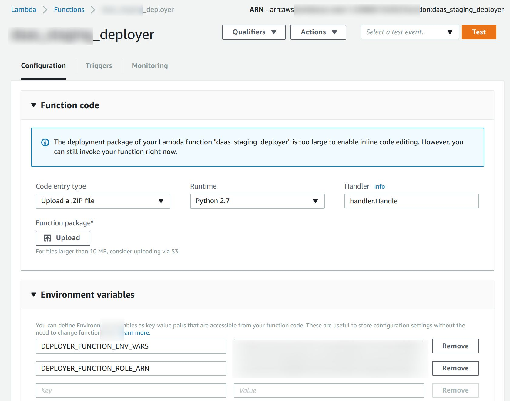
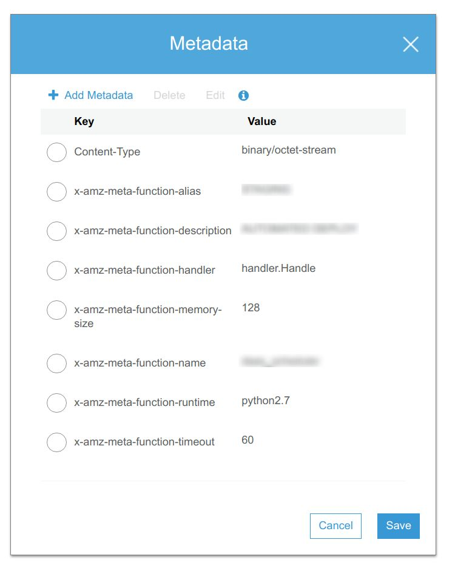

lambda-deployer
---------------

[](https://circleci.com/gh/mdevilliers/lambda-deployer)

Aim
---

Automate the deployment of lambda functions from either a developers machine or CI system.

Goals
-----

- Manage permissions and secrets :
  - AWS permissions are managed centrally with a minimum set exposed
  - Sensitive configuration information e.g. database connection credentials are not exposed to either a CI system, developer machine or (shock horror) Github!
- Easy to integrate CI or the developer workflow
- Integrate cleanly with existing AWS environments
- Ability to upload and deploy functions to multiple AWS regions
- Ability to automatically delete unused functions

Usage
-----

- download a [release](https://github.com/thingful/daas/releases)
- create an AWS S3 bucket to handle the uploads of deployment packages.
- create an AWS IAM role with the permissions to PutObject on the S3 bucket. This users credentials will be used to upload packages to S3.
- create an AWS IAM role with the permissions your lambda function needs. This users credentials will be used to run your lambda function.
- deploy the `lambda-deployer` as an AWS lambda function using the terraform module.

```
module "auto_deployer" {
  source = "git@github.com:mdevilliers/lambda-deployer//terraform/modules/lamda-deployer"

  application       = "${var.application}" // name of your application
  environment       = "${var.environment}" // logical environment e.g. production
  deployer_filepath = "./some/path/lambda-deployer.zip" // path to the deployer zip file

  function_role_arn = "${aws_iam_role.lambda_exec_role.arn}" // arn of the AWS IAM role your function needs
  s3_bucket_arn     = "${aws_s3_bucket.deployment_uploads.arn}" // arn of the AWS S3 bucket to monitor for uploads
  s3_bucket_id      = "${aws_s3_bucket.deployment_uploads.id}" // name of the AWS S3 bucket bucket to monitor for uploads

  maximum_unaliased_versions = 10 // number of unused functions to be retained

  env_vars = {
    variables = {
      FOO          = "BAR" // variables to configure the lambda function with
    }
  }
}

```




There is an example terraform package using the terraform [module](https://github.com/mdevilliers/lambda-deployer/tree/master/terraform)

- download and configure the lambda-uploader with the credentials of the upload user, the name of the S3 bucket and properties for your lambda function.

```
export AWS_REGION=some-region-1
export AWS_ACCESS_KEY_ID=**************
export AWS_SECRET_ACCESS_KEY=***********************

lambda-uploader-linux-amd64 up -b myS3Bucket \
                               -a myAlias \
                               -d "AUTOMATED DEPLOY" \
                               -e myEntry.Point \
                               -r python2.7 \
                               -n myFunction /path/to/function.zip

```

The lambda-uploader supports uploading to additional regions via the -g flag.

```

lambda-uploader-linux-amd64 up -b myS3Bucket \
                               -a myAlias \
                               -d "AUTOMATED DEPLOY" \
                               -e myEntry.Point \
                               -r python2.7 \
                               -g region-1 \
                               -g region-2 \
                               -n myFunction /path/to/function.zip

```

It is expected that: 
  - an S3 bucket of the same name will exist in all of the regions
  - the lambda-deployer will be deployed to each of the regions


On upload to the S3 bucket the zip file will have additional metadata for the lambda-deployer to use. This metadata is viewable via the AWS S3 user interface.



- the lambda-deployer will deploy the function

